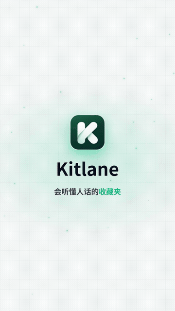
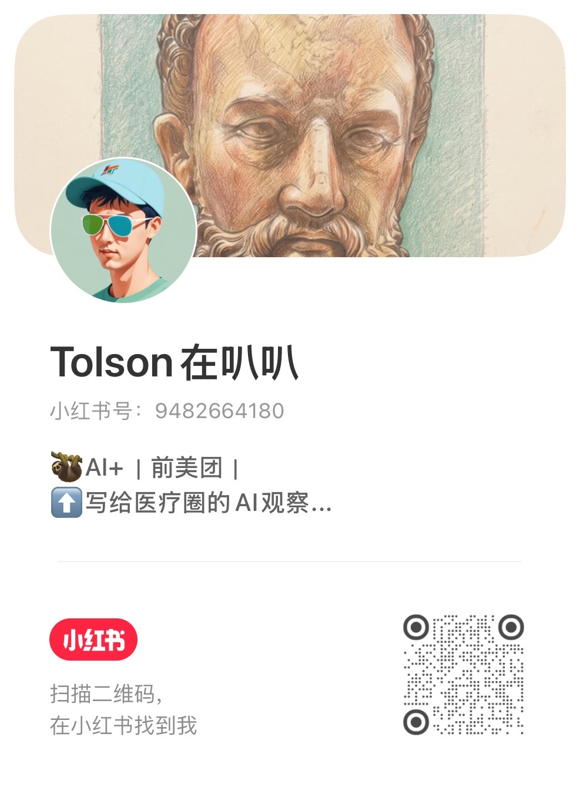

English | [简体中文](README.zh-CN.md)

# 🔖 Kitlane

> **Can't remember the name? You can still find the tool you saved.**

[MIT](LICENSE) · Chrome / Edge side panel · Chinese and English UI

A few hundred links, saved because they looked useful later. When later arrives, the name is gone. You scroll, search the web again, and open the wrong site.

Kitlane is for people who would rather not tidy. It leaves your folders alone. It reads the bookmarks you already have, tags each one by what it is for, and pulls up the right one when you type something like "a site that shrinks images."

<p align="center">
  
</p>

## Try it

Everything below is local search. No model, and no API key.

| You type | What comes back |
|---|---|
| find skills | SkillsMP, anthropics/skills, skills.sh, Smithery |
| system design interview material | LeetCode, coding-interview-university, system-design-primer |
| English papers | arXiv, SSRN |
| financial reports | HKEXnews, SZSE, CNINFO, SEC EDGAR |
| a quant backtesting platform | RiceQuant, Portfolio Visualizer, JoinQuant, QuantConnect |
| macroeconomic data | FRED, Jin10, World Bank, National Bureau of Statistics |
| web design inspiration | Dribbble, Behance, Awwwards, Godly |
| an AI tool for slides | AiPPT, iSlide, Gamma |
| collecting payments from overseas | PingPong, LianLian Global, Payoneer, Wise |

The sample is 480 bookmarks the author collected. Treat the examples lightly. The numbers further down explain why.

For a tighter order, turn on Smart search and let a model you configure re-rank the results.

## Features

- **Classify with no API key.** On import, bookmarks are sorted using a built-in library of 920+ sites, URL patterns, your folder names, and page descriptions. No model is called.
- **Search by the task.** "Remove background" finds image tools. "Annual report" finds filings.
- **Collections follow the tags.** Sharper tags make sharper collections. A new collection also gets tag suggestions from its name.
- **Bring your own model, if you want one.** Any OpenAI-compatible API works, in the cloud or locally through Ollama or LM Studio. The Jev decision model is optional.
- **Private links stay on the device.** Internal tools, online documents, account consoles, cloud-drive shares, invite and share links, links that carry a key or credential, and adult content are never sent to a model and never fetched.

## How accurate is it

Share of bookmarks left unclassified when no model is configured (lower is better).

| Source | Before | Now |
|---|---|---|
| The author's bookmarks (57) | 78% | **32%** |
| Highly voted Hacker News and Lobsters links (405) | 75% | **45%**, or **29%** after reading page descriptions |

On search: 61 colloquial Chinese queries, 480 sample bookmarks. The right result lands in the local top 30 **97%** of the time, and in the top 5 **92%** of the time.

Those figures are generous. The author's own set is only 57 bookmarks, and both the sample library and the queries were written by the author, so the search scores are optimistic and only useful for comparing one change with the next. Real-user numbers are still scarce. Anonymous aggregate stats are welcome as an issue.

## How it differs

The stores already list more than twenty AI bookmark extensions. Most of them file bookmarks into folders, and most of them wait for an API key before they do anything useful. Kitlane is aimed at a different job.

| | Most AI bookmark extensions | Kitlane |
|---|---|---|
| Job | Sort bookmarks into folders | Find a saved tool by the task; folders stay as they are |
| Works without a key? | Usually no | Yes. Classification and search run locally |
| Private links | Usually excluded by hand | Recognized automatically and kept on the device |

## Install

Kitlane is not in a browser store yet. Build it locally. You need Node.js 20 or later.

```bash
git clone https://github.com/Tolson64/Kitlane-extension.git
cd Kitlane-extension
npm ci
npm run build          # Chrome output: .output/chrome-mv3
npm run build:edge     # Edge output: .output/edge-mv3
```

Open `chrome://extensions` (on Edge, `edge://extensions`), turn on Developer mode, and load the unpacked output folder.

## Usage

1. Click the Kitlane icon in the toolbar to open the side panel.
2. Click the refresh icon at the top right to import your bookmarks.
3. Type in the search box.
4. For Smart search, open the gear, choose a model, fill in the address and key, and tick "Allow the model to analyze public bookmarks." The interface language is on that same screen.

## Privacy

Bookmarks are a private pile.

- The library, tags, and notes stay in your browser. Exported JSON does not include the API key.
- With no model enabled, nothing is sent to a third party.
- Private links stay local. They are not fetched, and they are not sent.
- With a model enabled, what is sent is your search description plus, for public bookmarks, the title, the URL path with parameters removed, the folder name, and the page description. Notes, custom titles, and private bookmarks are never sent.
- The optional Jev decision model by TypeSafe is a cloud API. It runs only when you enable it with your own key. Private bookmarks are never sent.
- Reading a page description asks permission for that site. Kitlane does not request access to every site at once, and it does not send login information.

The [technical notes](docs/technical-notes.zh.md) go further (Chinese).

## Still rough

- No cloud sync, and no JSON import. On another computer you import again, and tags you edited by hand do not travel with you.
- Chrome and Edge only. Safari is not supported yet.
- The API key is stored in plain text in the browser's local database. That is common for extensions, and worth knowing.
- How well Smart search follows colloquial Chinese depends on the model you choose. Models have not been compared side by side.
- A personal blog with no page description may stay unclassified when no model is configured.

## Contributing

Found a problem, or have an idea? Open an [issue](https://github.com/Tolson64/Kitlane-extension/issues). Pull requests are welcome.

For a chat, a collaboration, or feedback you would rather not post in public, email **465260295@qq.com**.

## License

[MIT](LICENSE). The change history is in the [changelog](CHANGELOG.md).

## Follow the author

Follow me on Xiaohongshu (RED) at 「Tolson在叭叭」 for AI × healthcare and handy tools.

<p align="center">
  
</p>
